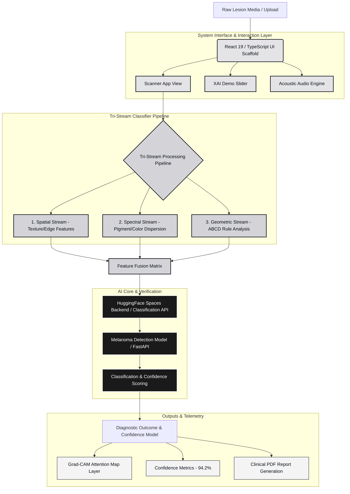

# 🧬 CancerCure (CC) | Tri-Stream Melanoma AI Diagnostic System

A high-fidelity, premium medical interface and diagnostic simulation engine for **CancerCure (CC)**. This system combines interactive genetic analytics, timeline-driven clinical workflows, a real-time lesion scanner, and an Explainable AI (XAI) insights portal to demystify neural network classifications of dermatological anomalies.

---

## 🏛️ System Architecture

The following diagram illustrates the workflow and architecture of the CancerCure diagnostic pipeline, from raw dermoscopic input to AI analysis, feature fusion, backend classification, and final visual/auditory outputs:



---

## 🎨 Design System & Aesthetic Architecture

The interface is engineered to evoke clinical authority, premium craftsmanship, and modern interactive fluidity.
- **Typography Matrix**:
  - **Space Grotesk & Inter**: Modern geometric sans headings paired with clean, readable clinical copy.
  - **JetBrains Mono**: Employed exclusively for scientific parameters, accuracy indexes, telemetry readouts, and status tags.
- **Color Palette**: Dark charcoal aesthetics (`#090F15`) juxtaposed against soft stone/gray backgrounds (`#D3D1CE` / `#FAFAFA`) with high-contrast indicator highlights.
- **Smooth Kinetic Motion**: Powered by **Lenis Scroll Engine** for smooth, momentum-based scrolling, paired with spring-physics layout animations via **Framer Motion**.
- **Interactive Spatial Perspective**: Utilizes mouse-coordinate calculations for a **2.5D hover tilt effect** on component cards (e.g., the contact card).
- **Physical Audio Feedback**: Native **HTML5 Web Audio API** synth oscillators trigger clinical chimes on hover and selection to deepen user immersion.

---

## 🚀 Key Modules & Code Architecture

### 1. 🔍 Tri-Stream AI Scanner (`ScannerApp.tsx`)
The centerpiece of the simulation. Users can upload high-resolution lesion media to run a multi-domain diagnostic check:
- **Interactive Comparison Slider**: A customized draggable slider comparing raw dermoscopic files with simulated Grad-CAM heatmap overlays.
- **Multi-Phase Scan Progressor**: Simulates feature extraction, tensor calculations, ABCD analysis, and HAM10000 archive cross-referencing.
- **Diagnostic Panel**: Yields a simulated confidence index (94.2%), asymmetry scale (0.88), and border irregular index (0.75), accompanied by PDF download actions.

### 2. 🧠 Explainable AI Insights Portal (`XaiDemo.tsx`)
Promotes model transparency by showing the neural network's focus fields:
- Displays Grad-CAM attention hotspots overlaid on clinical case segments (Superficial Spreading Phase vs. Nodular Cell Progression).
- Built-in horizontal comparison stage allows shifting between standard grayscale and dynamic activation map coordinates.

### 3. 📊 Live Counter Metrics (`ValidityStrip.tsx`)
- Fetches and animates validation benchmarks using an easing function trigger (`easeOutQuad`) once the component scrolls into the viewport.
- Showcases overall accuracy (80.03%), Mean AUC-ROC (0.9327), and benchmark scales (10,015 images) mapped from peer-reviewed databases (HAM10000).

### 4. 🎹 Acoustic feedback engine (`AudioEngine.ts`)
Synthesizes clinical telemetry tones dynamically using the Web Audio API without needing static audio files:
- `playHoverBeep()`: Fast, high-frequency exponential decay click for mouse hover indicators.
- `playSelectBeep()`: Rich triangle-wave chord shift for primary confirmations.
- `playPulseBeep()`: Rhythmic pulse simulating cardiovascular monitors.

---

## 📂 Repository Directory Tree

```filepath
CancerCure/
├── public/                 # Static clinical videos and images
│   ├── images/
│   └── videos/             # hero-dna.mp4 background video
├── src/
│   ├── components/         # Premium UI Components
│   │   ├── Advantages.tsx        # Grid highlighting system benefits
│   │   ├── AudioEngine.ts        # Web Audio API chime oscillators
│   │   ├── BoomerangVideoBg.tsx  # Loop-stabilized cinematic background
│   │   ├── ContactUs.tsx         # Encrypted contact form with 2.5D card tilts
│   │   ├── DNAHelixCanvas.tsx    # Optional pointer-reactive DNA helix
│   │   ├── Hero.tsx              # Cinematic hero section with video layer
│   │   ├── HowToUse.tsx          # Diagnostic step walkthrough
│   │   ├── Marquee.tsx           # Telemetry status infinite banner
│   │   ├── NavigationOverlay.tsx # Glassmorphic overlay drawer
│   │   ├── ScannerApp.tsx        # Lesion diagnostic scanner and comparison
│   │   ├── SearchDialog.tsx      # Modal search portal
│   │   ├── Team.tsx              # Specialist research bios
│   │   ├── Timeline.tsx          # Horizontal progress roadmap
│   │   ├── ValidityStrip.tsx     # Benchmark counters with viewport tracking
│   │   └── XaiDemo.tsx           # XAI Grad-CAM slider portal
│   ├── App.tsx             # Main view router (landing vs scanner views)
│   ├── index.css           # Global custom classes & scrolling animations
│   ├── main.tsx            # React entrypoint
│   └── types.ts            # Shared clinical TypeScript interfaces
├── .env.example            # Environment configurations (API endpoint, host URL)
├── package.json            # Scripts and dependency manifests
├── tsconfig.json           # Type configurations
└── vite.config.ts          # Vite configuration with tailwindcss plugin
```

---

## 🛠️ Installation & Setup

### Prerequisites
Make sure you have [Node.js](https://nodejs.org/) installed (version 18+ recommended).

### 1. Install Dependencies
Navigate to the root directory and install npm packages:
```bash
npm install
```

### 2. Configure Environment Variables
Copy `.env.example` to create a `.env.local` or `.env` file in the root directory:
```bash
cp .env.example .env.local
```
Fill in the configuration:
- `APP_URL`: The hosting address used for self-referential endpoints (e.g., OAuth callbacks, API links).

### 3. Start Development Server
Launch the application locally on Vite's default development port:
```bash
npm run dev
```
Open `http://localhost:3000` in your browser.

### 4. Build for Production
Bundle the optimized static files:
```bash
npm run build
```

---

## ⚙️ Configuration & Customization

- **Adjust Ticker Scrolling Speed**:
  In [src/index.css](file:///d:/College/RCCIIT/Final%20Yr%20Project/8th%20sem%20FYP/CancerCure/src/index.css), tweak the duration parameter inside `.animate-infinite-scroll` (default is `40s`).
- **Control ECG Pulse Rate**:
  In `src/components/Visualizer.tsx` (if using ECG metrics), change the frequency cycle inside `ecgWaveform` to accelerate or slow down the heart rate animation.
- **Audio Control**:
  The audio synthesis engine features an **ON/OFF** toggle button in the header toolbar, letting users mute the oscillator feedback loops.

---

## 🩺 Clinical & Educational Disclaimer

> [!WARNING]
> This application is a **clinical prototype, landing page demonstration, and software simulation**. It is created for academic and research presentation purposes. It is **not** a diagnostic medical tool. The simulated classifications, confidence percentages, and attention heatmaps are for illustrative and design validation purposes only. Do not use for medical advice, self-diagnosis, or clinical decision support.
